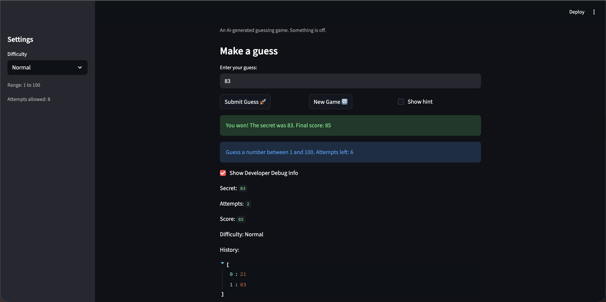

# 🎮 Game Glitch Investigator: The Impossible Guesser

## 🚨 The Situation

You asked an AI to build a simple "Number Guessing Game" using Streamlit.
It wrote the code, ran away, and now the game is unplayable. 

- You can't win.
- The hints lie to you.
- The secret number seems to have commitment issues.

## 🛠️ Setup

1. Install dependencies: `pip install -r requirements.txt`
2. Run the broken app: `python -m streamlit run app.py`

## 🕵️‍♂️ Your Mission

1. **Play the game.** Open the "Developer Debug Info" tab in the app to see the secret number. Try to win.
2. **Find the State Bug.** Why does the secret number change every time you click "Submit"? Ask ChatGPT: *"How do I keep a variable from resetting in Streamlit when I click a button?"*
3. **Fix the Logic.** The hints ("Higher/Lower") are wrong. Fix them.
4. **Refactor & Test.** - Move the logic into `logic_utils.py`.
   - Run `pytest` in your terminal.
   - Keep fixing until all tests pass!

## 📝 Document Your Experience

- Describe the game's purpose.
   - The game is a number-guessing challenge where players try to guess a randomly generated secret number within a difficulty-based range (Easy: 1-20, Normal: 1-100, Hard: 1-1000). Players get hints ("too high" or "too low") after each guess, earn points for winning (more for faster wins), and have limited attempts before the game ends. It's designed with intentional "glitches" to make it feel buggy and unpredictable, encouraging investigation and fixes.

- Detail which bugs you found.
   - **Hint messages were backwards:** "Too high" showed "Go HIGHER!" (should be "Go LOWER!"), and vice versa, with wrong emojis.
   - **Win scoring was unfair:** Formula deducted too many points (e.g., 80 for a 1st-attempt win instead of 100).
   - **Hard difficulty range was too small:** Set to 1-50 instead of a challenging 1-1000.
   - **UI updates lagged:** Developer console and attempt count only updated after a second guess due to Streamlit's rerun order.
   - **Difficulty changes didn't reset the game:** Switching mid-game kept the old secret, potentially out of the new range.
   - **Attempts counter started wrong:** Began at 1, making "attempts left" display incorrectly.
   - **Secret number seemed unstable:** Due to buggy string conversions on even attempts, causing comparison errors.
- Explain what fixes you applied.
   - **Fixed hints and scoring:** Corrected message text/emojis in check_guess and adjusted win formula to 100 - 10*(attempt_number - 1) for fair rewards.
   - **Updated ranges:** - Changed Hard to 1-1000.
   - **Improved UI Responsiveness:** - Moved st.info and debug display after submit logic so updates appear immediately.
   - **Added auto-reset on difficulty change:** Detects changes and starts a new game automatically.
   - **Fixed counters:** Set attempts to start at 0, updated info to use dynamic ranges.
   - **Enhanced tests:** Added test_update_score_win and updated existing tests to unpack tuples.

## 📸 Demo

- 

